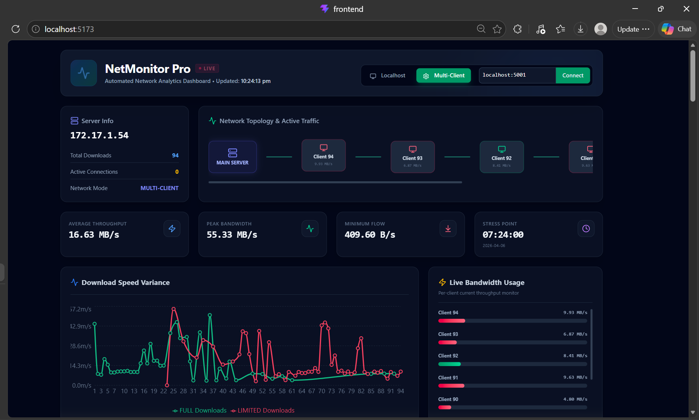
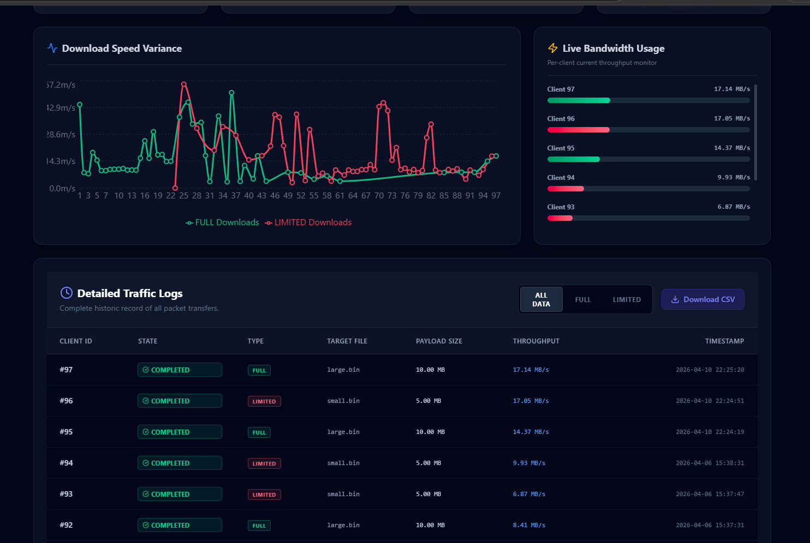

#  Secure Multi-Client Network Monitoring System

A full-stack, real-time network monitoring platform built with **Python Sockets (SSL/TLS)**, **Flask REST API**, and a **React + Vite dashboard**. The system enables a central server to securely transfer files to multiple remote clients over encrypted sockets, while each client reports its download performance back to a live dashboard.

---

##  Dashboard Preview

| Main Dashboard | Analytics View |
|---|---|
|  |  |

---

##  Architecture Overview

```
┌─────────────────────────────────────────────────────────────────┐
│                         Central Server                          │
│                                                                 │
│   ┌──────────────┐    ┌──────────────┐    ┌─────────────────┐  │
│   │  Socket      │    │  Flask REST  │    │  React + Vite   │  │
│   │  Server      │    │  API         │    │  Dashboard      │  │
│   │  (SSL/TLS)   │    │  (Port 5001) │    │  (Port 5173)    │  │
│   │  Port 5000   │    └──────┬───────┘    └────────┬────────┘  │
│   └──────┬───────┘           │                     │           │
└──────────┼────────────────────┼─────────────────────┼──────────┘
           │ Encrypted File     │ REST API (JSON)      │ Fetch/Axios
           │ Transfer (SSL)     │                      │
    ┌──────▼───────┐      ┌─────▼──────────┐          │
    │  Remote       │      │  ../data/       │          │
    │  Clients      │      │  download_log   │◄─────────┘
    │  (client.py)  │      │  .csv          │
    └──────┬────────┘      └────────────────┘
           │ POST metrics
           └──────────────────────────────────► Flask /api/log_download
```

---

##  Project Structure

```
socket_project/
│
├── backend/                    # Flask REST API + Socket Server
│   ├── server.py               # SSL/TLS socket server (Port 5000)
│   ├── app.py                  # Flask API server (Port 5001)
│   ├── analyzer.py             # Standalone network analysis script
│   ├── logger.py               # Client-side logging utility (sends metrics to API)
│   ├── downloader.py           # Client download orchestration
│   ├── scheduler.py            # Automated scheduling of downloads
│   ├── visualizer.py           # Backend data visualization helper
│   ├── cert.pem                # SSL certificate (self-signed)
│   ├── requirements.txt        # Python dependencies
│   └── testfile.bin            # Sample file served to clients (10 MB)
│
├── client/                     # Remote client scripts
│   ├── client.py               # Basic SSL socket client
│   └── client1.py              # SSL client with unverified context (multi-client)
│
├── frontend/                   # React + Vite dashboard
│   ├── src/
│   │   ├── App.jsx             # Main dashboard application
│   │   ├── App.css             # Component styles
│   │   ├── index.css           # Global styles
│   │   └── main.jsx            # React entry point
│   ├── index.html              # Root HTML
│   ├── package.json            # NPM dependencies
│   ├── vite.config.js          # Vite configuration
│   ├── tailwind.config.js      # Tailwind CSS configuration
│   ├── DashBoard_preview1.png  # Dashboard screenshot
│   └── DashBoard_preview2.png  # Dashboard screenshot
│
├── AutomatedNetworkAnalyzer/   # Standalone network analyzer module
│   └── visualizer.py
│
├── data/                       # Auto-generated download logs
│   └── download_log.csv        # CSV log of all client downloads
│
├── .gitignore
└── README.md
```

---

##  Features

###  Secure File Transfer
- SSL/TLS encrypted socket connections between server and clients
- Self-signed certificate support (`cert.pem` / `key.pem`)
- Multi-threaded server handles simultaneous client connections

### Real-Time Dashboard
- Live metrics: active clients, total downloads, avg/max/min speed
- Download speed time-series chart (Recharts)
- Per-client download status table: `ACTIVE`, `COMPLETED`, `FAILED`
- Client type classification: `FULL` (>5 MB) vs `LIMITED` (≤5 MB)
- Network topology overview and server IP display
- Auto-refreshing data every few seconds

###  REST API (Flask)
| Endpoint | Method | Description |
|---|---|---|
| `/network_info` | GET | Server IP, total/active clients, mode |
| `/logs` | GET | Full download log as JSON |
| `/analysis` | GET | Avg, max, min speed + busiest time |
| `/clients` | GET | Per-client detail with status |
| `/api/log_download` | POST | Receive and store client metrics |

###  Automated Scheduling
- `scheduler.py` supports periodic automated download runs
- Centralized logging across multiple remote clients

---

##  Tech Stack

| Layer | Technology |
|---|---|
| Socket Server | Python `socket`, `ssl`, `threading` |
| REST API | Flask, Flask-CORS |
| Data Analysis | Pandas |
| Scheduling | `schedule` |
| Frontend | React 19, Vite 8 |
| UI Components | Tailwind CSS 4, Recharts, Lucide React |
| HTTP Client | Axios |

---

##  Getting Started

### Prerequisites
- Python 3.8+
- Node.js 18+ and npm

---

### 1. Clone the Repository

```bash
git clone https://github.com/Ramitha-R6/socket-project.git
cd socket-project
```

---

### 2. Generate SSL Certificates (if not using the included `cert.pem`)

```bash
cd backend
openssl req -x509 -newkey rsa:2048 -keyout key.pem -out cert.pem -days 365 -nodes
```

>  **Note:** `key.pem` is excluded from version control via `.gitignore`. You must generate it locally.

---

### 3. Setup Backend

```bash
cd backend
pip install -r requirements.txt
```

**Start the SSL Socket Server** (serves `testfile.bin` to clients):
```bash
python server.py
```

**Start the Flask REST API** (in a separate terminal):
```bash
python app.py
```

---

### 4. Setup & Run the Client(s)

> On each remote machine (or locally for testing), configure the server IP in the client script.

```bash
cd client
```

Edit `client1.py` and set `HOST` to the server's IP address:
```python
HOST = "YOUR_SERVER_IP"  # e.g., "192.168.1.100"
PORT = 5000
```

Run the client:
```bash
python client1.py
```

The client will:
1. Connect to the socket server via SSL
2. Download `testfile.bin`
3. Report download metrics (size, duration, speed) to the Flask API

---

### 5. Setup & Run the Dashboard

```bash
cd frontend
npm install
npm run dev
```

Open your browser at **[http://localhost:5173](http://localhost:5173)**

---

##  Multi-Client Setup

To deploy across multiple machines on the same network:

1. **Server Machine** – Run `backend/server.py` and `backend/app.py`
2. **Client Machines** – Run `client/client1.py` after updating `HOST` to the server's LAN IP
3. **Dashboard** – Accessible from any machine at `http://<SERVER_IP>:5173`

The Flask API listens on `0.0.0.0:5001`, making it accessible to all clients on the network.

---

##  Data Flow

```
1. Client connects → SSL handshake → File download begins
2. Download complete → client logs: size, duration, speed
3. Logger POSTs metrics to → Flask /api/log_download
4. Flask appends data to → data/download_log.csv
5. Dashboard fetches → /clients, /analysis, /logs → renders live charts
```

---

## Configuration Reference

| Variable | File | Default | Description |
|---|---|---|---|
| `HOST` | `backend/server.py` | `0.0.0.0` | Socket server bind address |
| `PORT` | `backend/server.py` | `5000` | Socket server port |
| `HOST` | `client/client1.py` | `10.20.201.71` | Target server IP for clients |
| `LOG_FILE` | `backend/app.py` | `../data/download_log.csv` | Download log path |
| Flask port | `backend/app.py` | `5001` | REST API port |
| Vite port | `frontend/vite.config.js` | `5173` | Dashboard port |

---

##  Dependencies

### Backend (`backend/requirements.txt`)
```
flask
flask-cors
pandas
schedule
```

### Frontend (`frontend/package.json`)
```
react, react-dom, axios, recharts, lucide-react
tailwindcss, vite, postcss, autoprefixer
```

---

##  Contributing

1. Fork the repository
2. Create a new branch: `git checkout -b feature/your-feature`
3. Commit your changes: `git commit -m 'Add your feature'`
4. Push to branch: `git push origin feature/your-feature`
5. Open a Pull Request

---

##  License

This project is open source and available under the [MIT License](LICENSE).

---

<div align="center">
  <strong>Built with using Python Sockets, Flask & React</strong>
</div>
